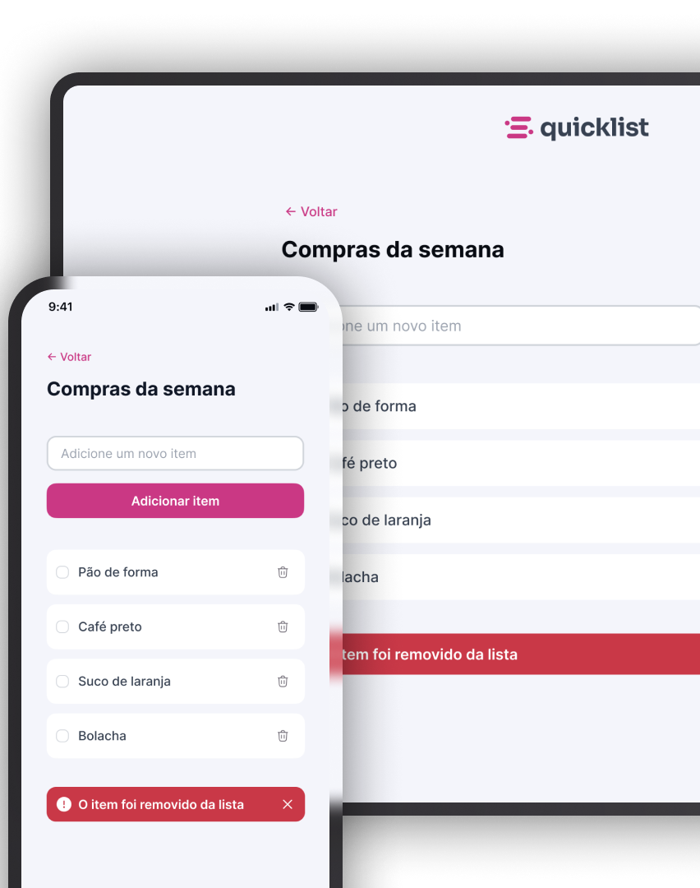

# Desafio prático - Lista de Compras

  

## Sobre o Desafio

Este projeto foi desenvolvido como parte do desafio prático, onde o projeto consiste em ser um site responsico de lista de compras, no qual o usuário pode gerenciar os itens adicionando ou removendo eles.

Neste desafio , pude aplicar os conceitos como:

* Manipulação com o DOM
* Funções
* Eventos 

## Tecnologias

As seguintes ferramentas foram usadas no desenvolvimento desse projeto:

- **JavaScript**
- **HTML**
- **Tailwind CSS**

